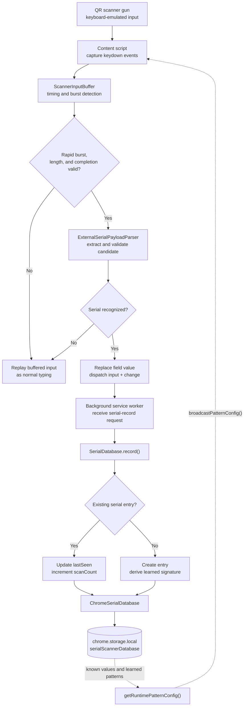

# Serial Scanner Helper v1.0

Serial Scanner Helper is a Manifest V3 browser extension that turns combined or noisy QR scanner input into a clean, usable serial number based on format and pattern.

Many scanner guns do not behave like cameras or special-purpose peripherals. They behave like very fast keyboards. A single scan can therefore arrive as a sequence such as:

```text
C1X83B200HK,PFLBN00WBAM0CJ,B4B68622CD75
```

The extension recognizes the scanner burst, extracts the intended value, and places only the serial below into the active field:

```text
PFLBN00WBAM0CJ
```

That means the page receives the value it needs instead of the complete multi-field payload produced by the scanner.

## Demo

The animation below shows the extension being used with a scanner-style input flow:

<div align="center">
  
</div>

## Why this project exists

The original problem was small but disruptive: a QR scanner was entering more information than the receiving web form expected. Manual cleanup slowed down the workflow, while simply listening for key events could not reliably tell a person typing from a scanner gun.

This project treats scanner input as a timed data stream. It buffers the burst, validates the timing and serial format, updates the field in a browser-friendly way, and records successful values locally for future scans. The result is a lightweight bridge between physical scanner hardware and ordinary web forms.

## Highlights

- Detects rapid keyboard-emulated scanner bursts without requiring camera access.
- Supports text inputs, text areas, and contenteditable fields, including fields inside frames.
- Prevents the raw multi-value scanner payload from leaking into the page when a scan is recognized.
- Extracts the correct serial from delimited payloads, prefixed values, and embedded serial formats.
- Dispatches real `input` and `change` events so standard forms and frontend frameworks can respond normally.
- Learns approved serial values conservatively instead of creating a broad, unsafe pattern.
- Stores the local serial database in `chrome.storage.local`; no server or external account is required.
- Includes a popup for enabling or disabling capture, loading pattern rules, and adding serial exceptions.

## How the system works

The content script starts at page load and listens during the capture phase. It ignores modifier keys, measures the speed of the character burst, and waits for a configured terminator such as **Enter** or **Tab**. An idle pause can also complete a scan when the scanner does not send a suffix key.

Once the input looks like a scanner burst, the parser:

1. Splits a delimited payload and selects the configured candidate segment.
2. Normalizes the candidate to uppercase.
3. Checks known values and learned signatures.
4. Applies the configured long-serial, legacy, modern, prefix-stripping, and embedded-serial rules.
5. Returns the first valid serial, or rejects the payload when no candidate is trustworthy.

For a valid result, the content script replaces the field value and dispatches `input` and `change` events. It then sends the serial to the background service worker. Invalid or slow input is replayed as normal typing, so the extension does not interfere with ordinary keyboard use.

## Recognition and database flow



The database is local to the browser profile. A new serial is stored with its first-seen time, last-seen time, scan count, source, and a learned signature made from its length, first four characters, and letter/digit shape. When the same serial is scanned again, the existing entry is updated instead of duplicated.

## Function guide

The main responsibilities are separated so the scanner logic can be tested without launching a browser.

| Area | Function or class | Responsibility |
| --- | --- | --- |
| Scanner input | `ScannerInputBuffer.addCharacter()` | Adds one character to the active burst and resets the burst when the inter-key timing becomes too slow. |
| Scanner input | `ScannerInputBuffer.complete()` | Decides whether the buffered characters meet the minimum length and total-duration rules for scanner input. |
| Scanner input | `CaptureScannerInput.recordCharacter()` / `complete()` | Connects timing detection to serial payload parsing. |
| Serial parsing | `ExternalSerialPayloadParser.parse()` | Extracts candidates from a payload, normalizes them, and applies the configured validation rules. |
| Page integration | `replaceEditableValue()` | Updates an input, text area, or contenteditable element and emits browser events expected by web forms. |
| Database | `SerialDatabase.record()` | Normalizes a serial, creates a new entry, or updates an existing entry's timestamps and scan count. |
| Database learning | `deriveLearnedSerialPattern()` | Builds a conservative signature from serial length, prefix, and character shape. |
| Database learning | `matchesLearnedSerialPattern()` | Confirms that a future candidate matches a stored learned signature exactly. |
| Runtime configuration | `getRuntimePatternConfig()` | Combines the bundled or uploaded rules with stored known values and learned patterns. |
| Runtime configuration | `broadcastPatternConfig()` | Sends updated rules and scanner state to open tabs without requiring a page refresh. |
| Popup controls | `loadPatternFile()`, `clearPatternOverride()` | Validate, store, or remove a local pattern configuration override. |
| Popup controls | `setScannerEnabled()` | Persists the ON/OFF state and updates open tabs. |
| Popup controls | `addSerialException()` | Sends a manually approved serial to the local database. |

## Serial rules and configuration

The rules are kept outside the JavaScript bundle so deployment-specific validation can change without rewriting the scanner logic.

- `public/serial-pattern.json` is the local deployment configuration and is ignored by Git so proprietary rules can remain private.
- `public/serial-pattern.example.json` is the safe fallback template used when the local deployment file is not present.
- The selected configuration is copied to `dist/serial-pattern.json` and validated before it is used.
- The popup can load a JSON configuration as a local override and can reset to the bundled configuration at any time.

The configuration controls scanner timing, payload separators, candidate selection, normalization, known values, learned patterns, prefix stripping, embedded serial detection, and the supported serial formats. The active deployment rules mirror the scanner-relevant behavior from `SE_Modules/qr_detector.py` without importing Python code into the browser bundle.

The most important scanner timing settings are:

```json
{
  "minimumCharacters": 8,
  "maxInterKeyMs": 100,
  "maxSequenceMs": 5000,
  "completionIdleMs": 250,
  "terminators": ["Enter", "Tab"]
}
```

## Project structure

```text
src/
├── domain/          Browser-independent models, rules, and ports
├── application/     Scanner and serial-database use cases
├── infrastructure/  Chrome storage, configuration, and parser adapters
├── entrypoints/     Background service worker and content script
├── popup/           Popup markup, styles, and user controls
└── shared/          Typed messages exchanged between extension contexts
public/
├── assets/          Extension logo and demo animation
└── serial-pattern.example.json
```

The layered structure keeps Chrome APIs at the infrastructure boundary. The timing buffer, serial parser, database behavior, and configuration validation can therefore be tested with ordinary unit tests.

## Development

Requirements:

- Node.js 20 or newer
- npm 10 or newer

Install dependencies and run the checks:

```sh
npm install
npm run typecheck
npm test
npm run build
```

The build creates an unpacked extension in `dist` and a ready-to-import archive at `dist/serial-scanner-helper-extension.zip`. The ZIP contains `manifest.json` at its root, along with the popup, bundled configuration, compiled scripts, and assets.

For active source development, use:

```sh
npm run dev
```

This watches the TypeScript entrypoints and rebuilds the extension bundles.

To test the extension manually in Chromium-based browsers:

1. Open the extensions page.
2. Enable **Developer mode**.
3. Choose **Load unpacked**.
4. Select the project `dist` directory.
5. Focus a supported input field and scan a QR value.

## Testing focus

The automated tests cover the parts most likely to cause a bad scan:

- scanner timing and sequence completion;
- extraction of the correct segment from a multi-value payload;
- validation of legacy, modern, long, known, learned, and embedded serial formats;
- configuration parsing and validation;
- database creation, updates, counts, timestamps, and learned signatures.

The representative payload used during development is:

```text
C1X83B200HK,PFLBN00WBAM0CJ,B4B68622CD75
```

The expected extracted value is `PFLBN00WBAM0CJ`.

## Python module boundary

The extension mirrors the scanner-relevant string behavior from `SE_Modules/qr_detector.py`, especially `parse_qr_value` and `is_valid_hp_serial`.

The Python module depends on OpenCV, pyzbar, NumPy, and optional ZXing. It cannot be imported directly into a browser extension bundle, and image-based QR decoding is outside this project. The browser extension works with the scanner gun's keyboard input and implements the corresponding serial validation rules from the external configuration file.

## License

This project is released under the [MIT License](LICENSE).

Developed by Engr. Mercurio.
